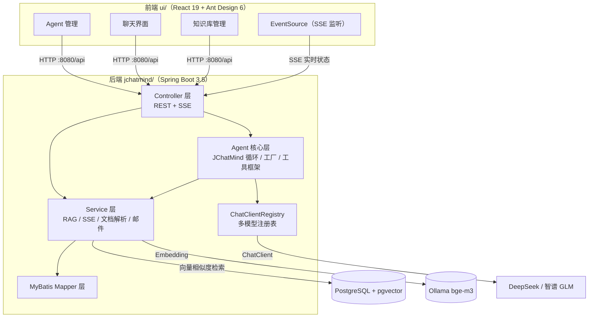
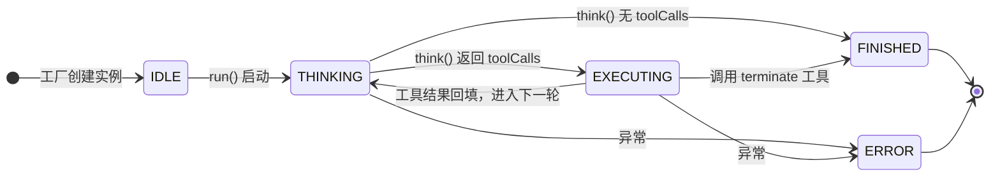
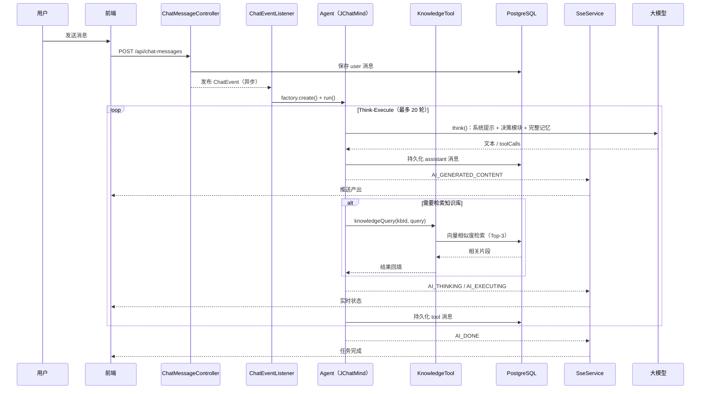

# JChatMind · AI 智能体助手


一个基于 **Spring AI** 的 Java Agent 系统：通过 **Think-Execute 循环**实现自主决策与多步任务规划，具备工具调用框架、RAG 知识库检索、多模型切换和 SSE 实时状态推送能力。

它不是"调一次 API 返回文本"的聊天机器人，而是一个能规划、能调用工具、能检索知识库、并把执行过程实时展示给用户的 **Agent**。

> 作者：[moondream69](https://github.com/moondream69) · 个人项目，基于 Spring AI 的 Agent 学习与工程实践

---

## 功能特性

- **Think-Execute 循环**：Agent 每轮先"思考"（调用大模型决定下一步），有工具调用则"执行"，工具结果回填对话历史后进入下一轮，直到任务完成；最大循环步数 20，防止无限循环。
- **状态机管理**：`IDLE → THINKING → EXECUTING → FINISHED / ERROR`，异常统一兜底为 `ERROR`。
- **框架化工具系统**：实现 `Tool` 接口 + `@Component` 即自动注册，新增工具不改核心流程；固定工具（所有 Agent 必带）与可选工具（按 Agent 配置启用）分类治理；关闭 Spring AI 自动执行，手动接管 ToolCalling 流程，工具结果可控持久化并推送前端。
- **RAG 知识库**：Markdown 解析分块 → bge-m3 嵌入（1024 维）→ pgvector 相似度检索（L2 距离，ivfflat 索引，Top-K=3）。
- **多模型架构**：ChatClientRegistry 注册表模式管理模型实例，DeepSeek / 智谱 GLM 可切换，扩展新模型零侵入。
- **SSE 实时通信**：思考 / 执行 / 完成状态实时推送，执行过程可视化。
- **对话记忆持久化**：所有消息落库，下次提问自动恢复上下文，支持断点续聊。
- **多 Agent 管理**：每个 Agent 独立配置系统提示词、模型、可用工具与可用知识库（JSONB 存储）。

## 技术栈

| 分类 | 技术 |
| --- | --- |
| 后端框架 | Spring Boot 3.5.8、Spring AI 1.1.0、Java 17 |
| 模型接入 | DeepSeek（`deepseek-v4-flash`）、智谱 GLM（`glm-4.6`） |
| 数据存储 | PostgreSQL + pgvector、MyBatis 3（XML Mapper + 自定义 TypeHandler） |
| Embedding | Ollama 本地部署 bge-m3 |
| 文档解析 | flexmark（Markdown） |
| 消息推送 | SSE（SseEmitter） |
| 其他 | Spring Mail（邮件工具）、Lombok |
| 前端 | React 19、TypeScript、Ant Design 6（ant-design/x）、Vite、Tailwind CSS 4 |

## 架构设计



## Agent 核心机制

### Think-Execute 循环



### 一轮对话的完整时序



要点：

- `think()` 将系统提示词 + 决策模块提示（告知 Agent 拥有哪些知识库、缺上下文优先检索）与完整记忆一并交给大模型，由模型决定下一步动作（`JChatMind.java`）；
- `execute()` 通过 `ToolCallingManager` **手动执行**工具（Spring AI 内部自动执行已被关闭），工具调用与返回均持久化为 `assistant` / `tool` 角色消息，并实时推送前端；
- 模型可通过内置 `terminate` 工具主动宣告任务结束；任一环节异常 → 状态置 `ERROR`，不会挂死。

## 快速开始

### 环境要求

| 依赖 | 版本要求 | 说明 |
| --- | --- | --- |
| JDK | 17+ | 后端运行环境 |
| Maven | 3.6.3+ | 构建后端 |
| PostgreSQL | 14+ | 需安装并启用 `pgvector` 扩展 |
| Ollama | 任意 | 本地嵌入服务，需先 `ollama pull bge-m3` |
| Node.js | 18+ | 构建前端 |

### 1. 初始化数据库

```bash
# 创建数据库（如已存在可跳过）
psql -U root -c "CREATE DATABASE jchatmind"

# 执行建表脚本（含 pgvector 扩展、向量表与 ivfflat 索引）
psql -U root -d jchatmind -f sql_assert/jchatmind.sql
```

`sql_assert/` 另附 eshop 演示业务库（`eshop.sql` + `eshop_data.sql`），供数据库查询工具演示使用。

### 2. 配置密钥

```bash
cd jchatmind
cp .env.example .env   # 填入自己的 DeepSeek / 智谱 API Key、邮箱授权码、数据库密码
```

`.env` 已被 `.gitignore` 忽略，密钥不会进入版本库；后端通过 `spring.config.import: optional:file:.env[.properties]` 加载，文件缺失时数据库配置回退默认值，API Key 缺失则启动失败（宁可失败也不静默运行）。

### 3. 启动后端

```bash
cd jchatmind
mvn spring-boot:run        # 默认端口 8080
```

### 4. 启动前端

```bash
cd ui
npm install
npm run dev                # 默认端口 5173（CORS 已放行 localhost 任意端口）
```

浏览器访问 http://localhost:5173 ，先创建一个 Agent（配置系统提示词 / 模型 / 工具 / 知识库），即可开始对话。

## 配置说明

所有敏感配置通过环境变量注入（`jchatmind/.env`，模板见 `.env.example`）：

| 环境变量 | 说明 |
| --- | --- |
| `DB_USERNAME` / `DB_PASSWORD` | PostgreSQL 账号密码（默认 `root` / `123456`，仅限本地开发） |
| `MAIL_USERNAME` / `MAIL_PASSWORD` | QQ 邮箱地址与 SMTP 授权码（发邮件工具使用） |
| `DEEPSEEK_API_KEY` | DeepSeek 开放平台 API Key |
| `ZHIPU_API_KEY` | 智谱开放平台 API Key |

部署到服务器时无需改代码，以系统环境变量或容器环境变量注入同名变量即可。

## 项目结构

```
├── LICENSE                     # MIT 开源许可
├── jchatmind/                  # 后端（Spring Boot）
│   ├── src/main/java/com/moondream/jchatmind/
│   │   ├── agent/              # Agent 核心
│   │   │   ├── JChatMind.java          # Think-Execute 循环 + 状态机
│   │   │   ├── JChatMindFactory.java   # 工厂：装配模型/工具/知识库/记忆
│   │   │   ├── AgentState.java         # 状态枚举
│   │   │   └── tools/                  # 工具框架（Tool 接口 + 各工具实现）
│   │   ├── config/             # ChatClientRegistry（多模型注册表）、CORS 等
│   │   ├── controller/         # REST + SSE 接口层
│   │   ├── converter/          # DTO/VO 转换、向量类型转换
│   │   ├── event/              # 事件发布与监听（驱动 Agent 运行）
│   │   ├── message/            # SSE 消息模型（SseMessage）
│   │   ├── model/              # entity / dto / vo / request / response
│   │   ├── service/            # 业务门面层（RAG、SSE、文档解析、邮件等）
│   │   └── typehandler/        # MyBatis 自定义 TypeHandler（pgvector）
│   └── src/main/resources/
│       ├── application.yaml    # 公共配置（敏感项全部为 ${ENV} 占位符）
│       ├── .env / .env.example # 本地密钥（不入库）/ 模板
│       └── mapper/             # MyBatis XML（含向量相似度 SQL）
├── ui/                         # 前端（React 19 + Ant Design 6 + Vite）
├── sql_assert/                 # 建表脚本 + eshop 演示数据
├── data/documents/             # 知识库文档存储目录（运行时自动创建）
└── examples/                   # 前端演示页面
```

## 工具清单

| 工具 | 类型 | 说明 |
| --- | --- | --- |
| `KnowledgeTool` | 固定 | 从指定知识库执行语义检索（RAG），返回相关片段 |
| `DirectAnswerTool` | 固定 | 直接回答（无需工具时使用） |
| `TerminateTool` | 固定 | 结束当前任务 |
| `databaseQuery` | 可选 | 在 PostgreSQL 执行只读 SELECT，拒绝非 SELECT 语句，结果格式化为 ASCII 表格 |
| 文件系统工具 | 可选 | 本地文件读写 |
| 邮件工具 | 可选 | 通过 QQ 邮箱 SMTP 发送邮件 |

Agent 的 `allowed_tools`（JSONB）决定挂载哪些可选工具。

## 扩展指南

### 新增一个工具

1. 实现 `Tool` 接口（`getName` / `getDescription` / `getType`），标注 `@Component`；
2. 用 Spring AI 的 `@Tool(name, description)` 注解标记可被模型调用的方法；
3. 类型选 `FIXED`（所有 Agent 可用）或 `OPTIONAL`（需在 Agent 的 `allowed_tools` 中启用）。

工具会被 Spring 自动收集（`ToolFacadeServiceImpl` 注入 `List<Tool>`），核心循环零改动。

### 接入一个新模型

1. 在 `MultiChatClientConfig` 新增 `ChatClient` Bean，Bean 名即模型名；
2. `ChatClientRegistry` 自动注册，Agent 的 `model` 字段填 Bean 名即可。

## 数据库设计

| 表 | 说明 |
| --- | --- |
| `agent` | Agent 定义：系统提示词、模型、`allowed_tools` / `allowed_kbs` / `chat_options`（JSONB） |
| `chat_session` | 会话（绑定 Agent，自动生成标题） |
| `chat_message` | 消息（`user` / `assistant` / `tool` 角色，metadata JSONB 存工具调用与返回） |
| `knowledge_base` | 知识库 |
| `document` | 知识库下的文档（md/pdf/txt，记录大小与元数据） |
| `chunk_bge_m3` | 文档分块 + `embedding VECTOR(1024)`，ivfflat 索引（lists=100） |

## API 一览

统一响应格式：`{ "code": 200, "message": "success", "data": ... }`，非 200 为业务错误。

| 方法 | 路径 | 说明 |
| --- | --- | --- |
| GET | `/api/agents` | Agent 列表 |
| POST | `/api/agents` | 创建 Agent |
| PATCH / DELETE | `/api/agents/{agentId}` | 更新 / 删除 Agent |
| GET | `/api/chat-sessions` | 会话列表 |
| POST | `/api/chat-sessions` | 创建会话 |
| PATCH / DELETE | `/api/chat-sessions/{sessionId}` | 更新 / 删除会话 |
| GET | `/api/chat-messages/session/{sessionId}` | 会话消息列表 |
| POST | `/api/chat-messages` | 发送消息（发布 ChatEvent，异步触发 Agent 运行） |
| PATCH / DELETE | `/api/chat-messages/{chatMessageId}` | 更新 / 删除消息 |
| GET / POST | `/api/knowledge-bases` | 知识库列表 / 创建 |
| GET / POST | `/api/documents` | 文档列表 / 上传（自动分块 + 向量入库） |
| GET | `/api/tools` | 可选工具列表 |
| GET | `/sse/connect/{chatSessionId}` | SSE 长连接（30 分钟超时，实时推送状态与产出） |

SSE 消息类型：`AI_GENERATED_CONTENT`（正式产出）、`AI_PLANNING` / `AI_THINKING` / `AI_EXECUTING`（过程状态）、`AI_DONE`（结束）。

## 演示

以"知识库问答 + 数据库查询"复合任务为例：

1. 在知识库页面上传 Markdown 文档（自动分块 + 向量入库）；
2. 创建 Agent 并配置 `allowed_kbs` 与 `allowed_tools`；
3. 发起提问 → 前端实时展示 Agent 的思考 / 执行 / 完成状态及各步骤工具调用；
4. 对话历史持久化，下次打开会话上下文自动恢复。

## License

本项目采用 [MIT License](./LICENSE) 开源许可。

Copyright © 2026 [moondream69](https://github.com/moondream69)
